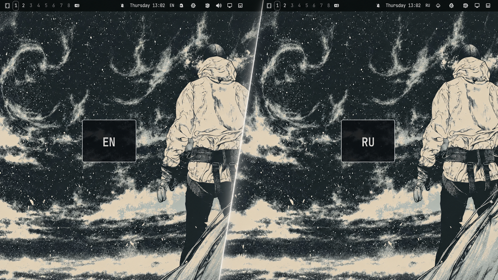

# Omarchy Keyboard Layout OSD

A centered, theme-aware keyboard layout indicator for Omarchy and Hyprland.

When the physical keyboard layout changes, the plugin briefly shows a translucent
card in the center of the screen with the active layout:

- `ES` — Spanish
- `EN` — English
- `RU` — Russian

The card fades in and out smoothly and does not capture keyboard or pointer input.
Events from virtual keyboards used by Fcitx5/Waynergy and system buttons are
ignored, so pasting text or dictating with Voxtype does not trigger the indicator.

## Preview

The indicator appears briefly when switching between keyboard layouts:



## Requirements

- Omarchy with Quickshell
- Hyprland
- A keyboard layout event named `activelayout`

## Install

```bash
omarchy plugin add https://github.com/alexbic/omarchy-keyboard-layout-osd.git --enable
```

Read the source before enabling it: Omarchy plugins run as unsandboxed QML code
inside the long-lived Omarchy shell process.

## Remove

```bash
omarchy plugin remove alexbic.keyboard-osd
```

## Development

Validate the plugin locally:

```bash
omarchy plugin validate .
```

The plugin uses the current Omarchy theme colors through `qs.Commons` and
`qs.Ui`.

## License

MIT. See [LICENSE](LICENSE).
